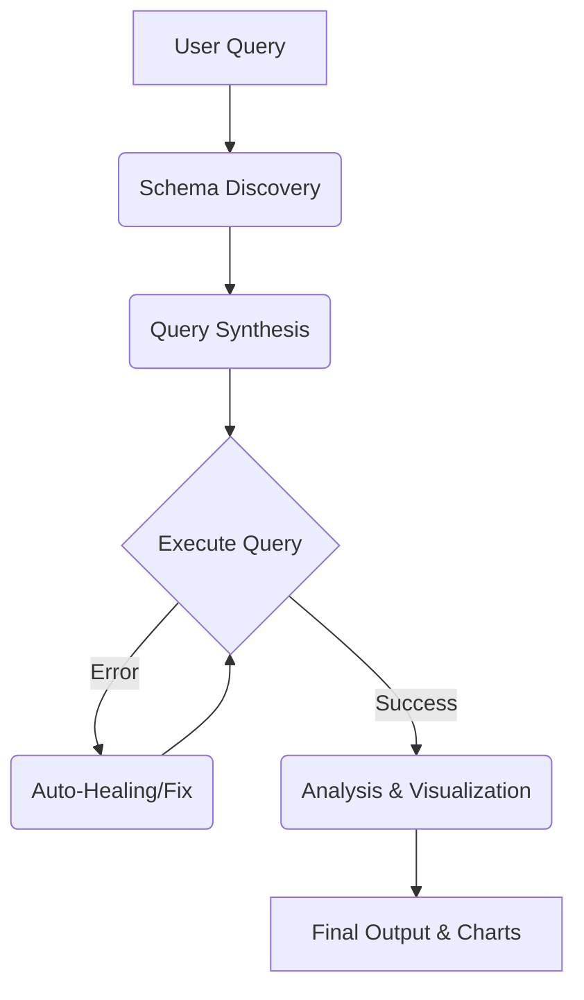

# Analytics Engine

[](https://nextjs.org/)
[](https://orm.drizzle.team/)
[](https://tailwindcss.com/)

A web interface for database querying and visualization using Next.js 15 and Drizzle ORM.

## Tech Stack

- **Frontend**: Next.js 15 (App Router), React
- **Styling**: Tailwind CSS v4, Lucide React Icons
- **Database Access**: Drizzle ORM, node-postgres (pg)
- **Charting**: Recharts
- **Testing**: Vitest

## Features

- **Provider Configuration**: Interface for inputting API keys and selecting processing providers.
- **Database Connection**: Accepts PostgreSQL or Supabase URI strings.
- **Data Visualization**: Renders Recharts (Bar, Area, Pie) from tabular query results.
- **Caching**: Stores previous queries locally.

## Workflow Architecture



## Directory Structure

```text
/
├── app/               # Next.js App Router (Layout, Page, API Routes)
├── components/        # React UI Components (Charts, Tables, Sidebar, SQL Display)
├── lib/
│   ├── agent/         # State Machine & Orchestration Logic
│   ├── db.ts          # Postgres Pool & Read-Only Tx Logic
│   ├── chart.ts       # Recharts Data Formatting
│   ├── schema.ts      # Drizzle ORM Schemas
│   └── serverUtils.ts # Security & SSRF Protection Utils
├── public/            # Static Assets
├── scripts/           # Dev & Build Scripts
└── next.config.ts     # Next.js Configuration
```

## Security

- **Transactions**: Executes SQL within a `SET TRANSACTION READ ONLY` block.
- **Regex Filtering**: Blocks `INSERT`, `UPDATE`, `DELETE`, `DROP`, `TRUNCATE`, `ALTER`.
- **Row Limits**: Appends `LIMIT 1000` to queries.
- **Storage**: API keys and connection strings are kept in browser `localStorage`.

## Getting Started

```bash
git clone https://github.com/GaneshArwan/AIDataAnalystAgent.git
cd AIDataAnalystAgent
npm install
npm run dev
```

## License

MIT License © 2026 GaneshArwan
